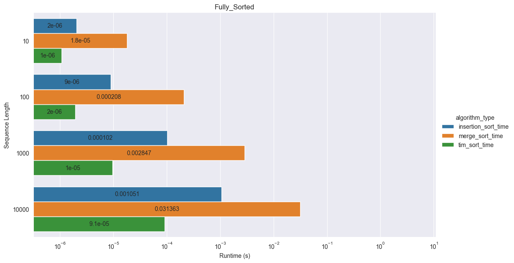
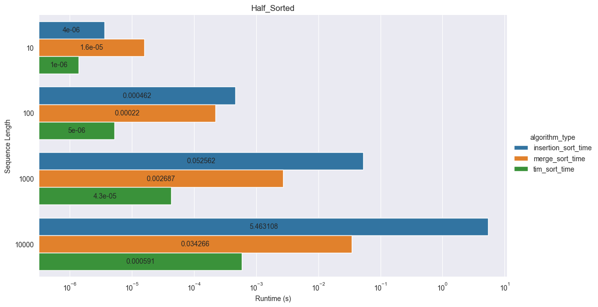
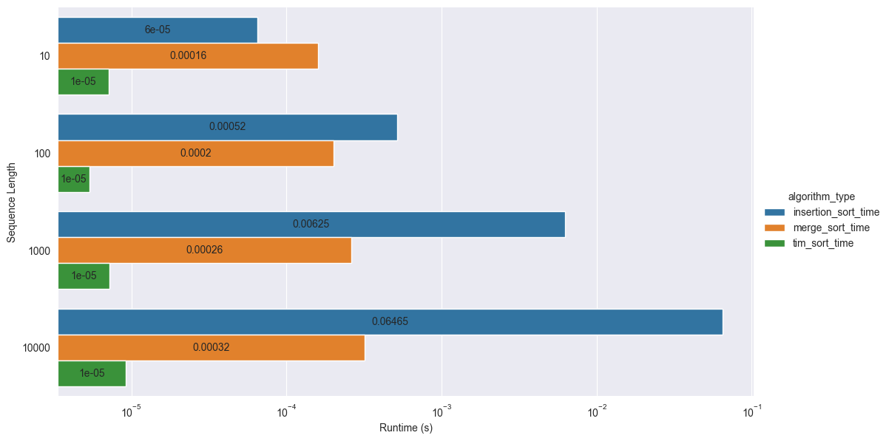
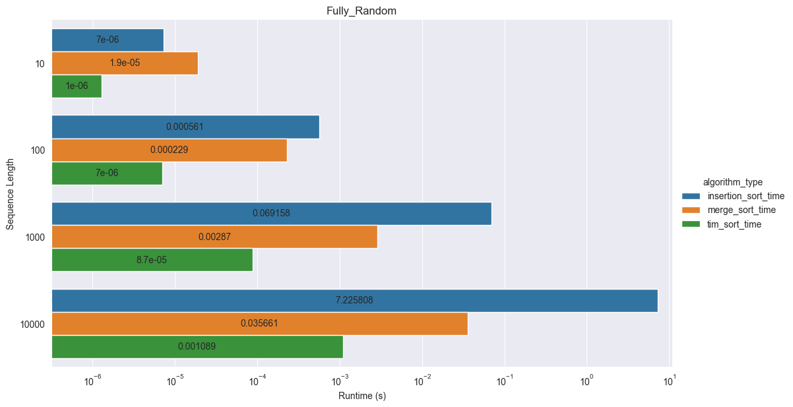

Kuba Czech | Adam Wilczyński

# Sorting Algorithms

## Algorithm Description

### Insertion Sort

This algorithm iterates over all elements in a list and for each element (starting from left) looks for suitable place in a sorted part of this array (on the left of current element). Algorithm is very similar to the way people sort playing cards.

#### Worst Case

Numbers are sorted, but from greatest to the smallest (decreasing order - maximum number of operations will be performed).

#### Average Case

Complexity is O(n^2)

#### Best Case

Numbers are sorted in an ascending way (complexity is linear - O(n), only comparisons are performed )

#### Practical Applications

Even though insertion sort is not optimal (because of time complexity), it is practical for almost sorted arrays of numbers, then only unsorted parts of array are changed. Its another advantage is simplicity and pretty good performance for smaller lists. Algorithm is stable and in place.

### Merge Sort

This algorithm uses recurrence to divide array into one-element sets, then all one-element sets are merged together. Merging works as follows: there are two arrays (both sorted, also singular elements count as sorted list), then we compare first elements elements of those two arrays, the smaller goes first and we move one place to the right in the array from which the element has been selected. We repeat this process until all elements from both lists are merged. Then we merge next two lists until every element from starting list is sorted.

#### Worst Case, Average Case, Best Case

No matter how sorted or chaotic is an array of numbers, time complexity is always O(n log n) - array is divided in subparts, then merged (order of numbers doesn’t matter). Because of that there are no best or worst case scenario.

#### Practical Applications

Merge sort is more efficient than for example insertion sort or selection sort. However, it is a bit more complex algorithm than insertion sort, especially because recursion is used. Algorithm is stable, but not in place, so some additional memory is needed.

### Tim Sort

Tim sort is Python's builtin adaptive sorting algorithm implemented in C.
We have decided to incorporate it in our research in order to compare its raise of complexity to sorting functions written in pure Python.

#### Worst Case

Fully random sequence.

#### Average Case

O(n * log n)

#### Best Case

Operates in linear O(n) time given already sorted sequence.

## Experiment Description

### Generating Test Data


```python
def get_fully_random_sequence(sequence_length: int, max_n: int):
    return [random.randint(1, max_n) for _ in range(sequence_length)]

def get_part_sorted_sequence(sequence_length: int, max_n: int):
    s = get_fully_random_sequence(sequence_length=sequence_length, max_n=max_n)
    number_of_sorts = random.randrange(sequence_length)
    start = 0
    for _ in range(number_of_sorts):
        end = random.randint(start, min(start + sequence_length // number_of_sorts, sequence_length))
        s = s[:start] + sorted(s[start:end]) + s[end:]
        start += sequence_length // number_of_sorts
    return s

def get_half_sorted_sequence(sequence_length: int, max_n: int):
    random_quarter = get_fully_random_sequence(sequence_length // 4, max_n)
    return random_quarter + sorted(random_quarter + random_quarter) + random_quarter

def get_fully_sorted_sequence(sequence_length: int, max_n: int):
    return sorted(get_fully_random_sequence(sequence_length=sequence_length, max_n=max_n))
```

We used Python's builtin timeit library for precise timing of sorting functions (we excluded input data generation time).

### Libraries Used

pandas, matplotlib, seaborn

## Experiment Results

Graphs below are sorted in order of increasing entropy.

### Fully Sorted Input


### Half Sorted Input (The sequence consists of half sequence sorted preceded and followed by unsorted quarter)


### Part Sorted Input (Random length parts of sequence are sorted)


### Fully Random Input


## Conclusions

Measured complexity does not differ from the expected one.

Graphs show a positive correlation between chaos of a sequence and time spent on sorting.

It is worth pointing out, the fact that insertion sort in faster than merge sort on sequences of few elements.


